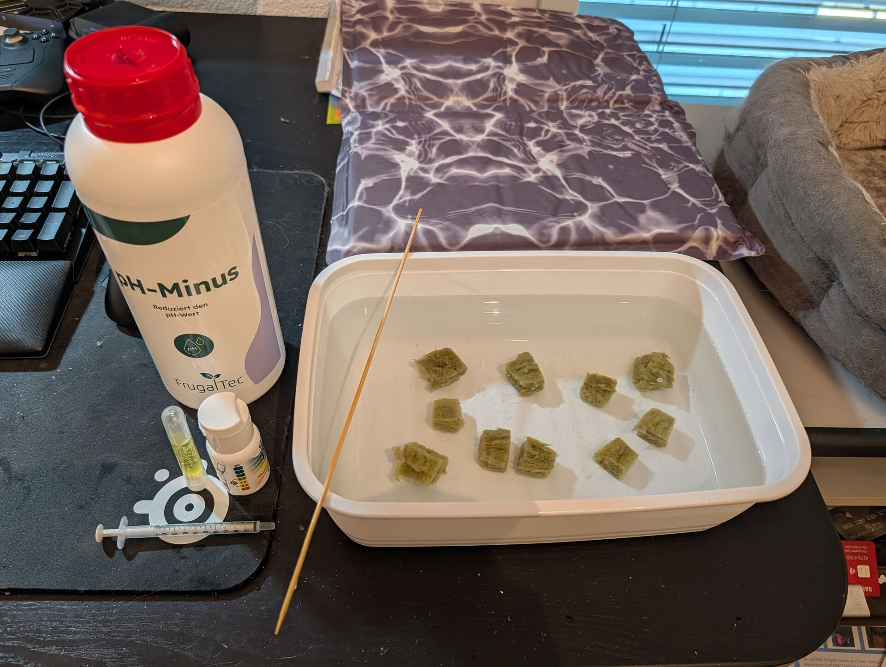
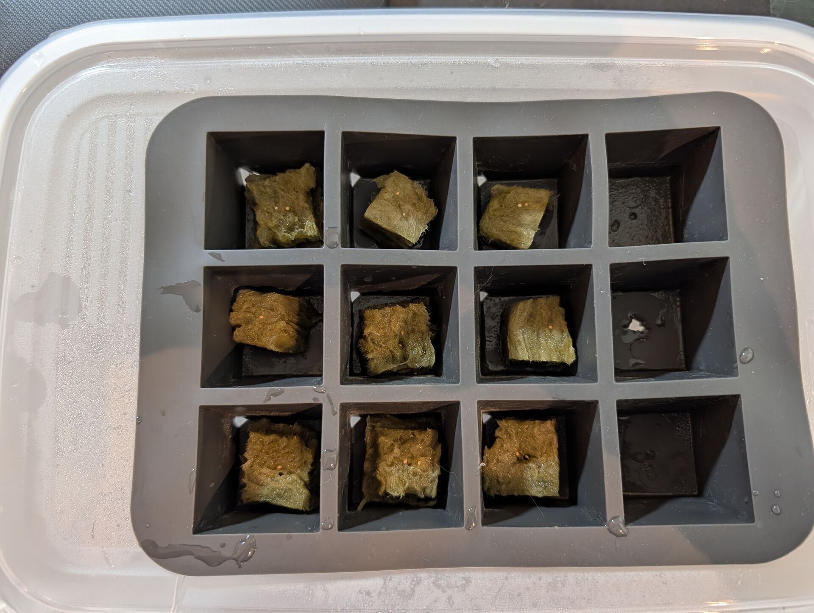
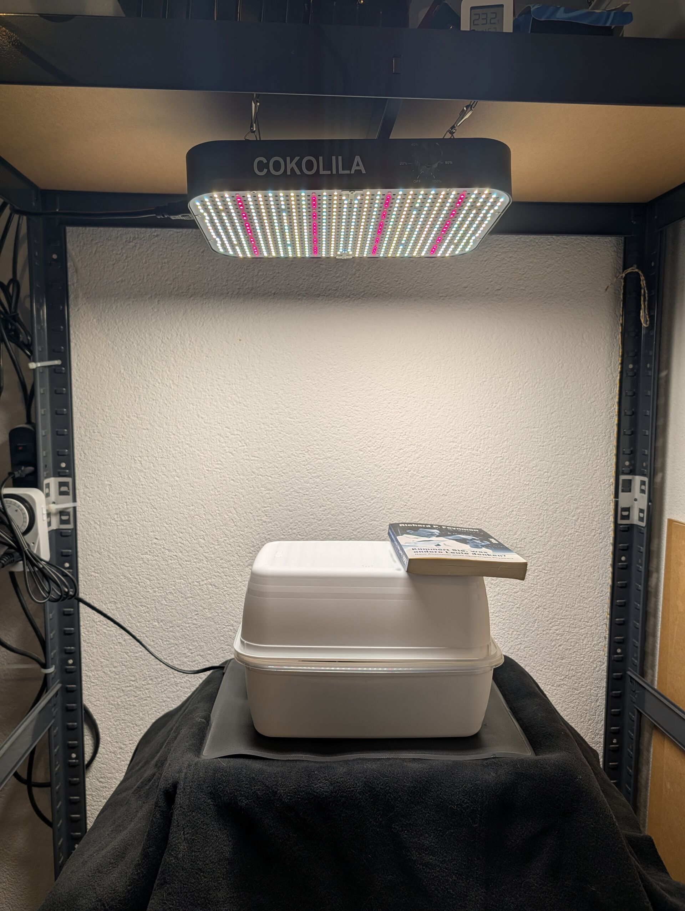
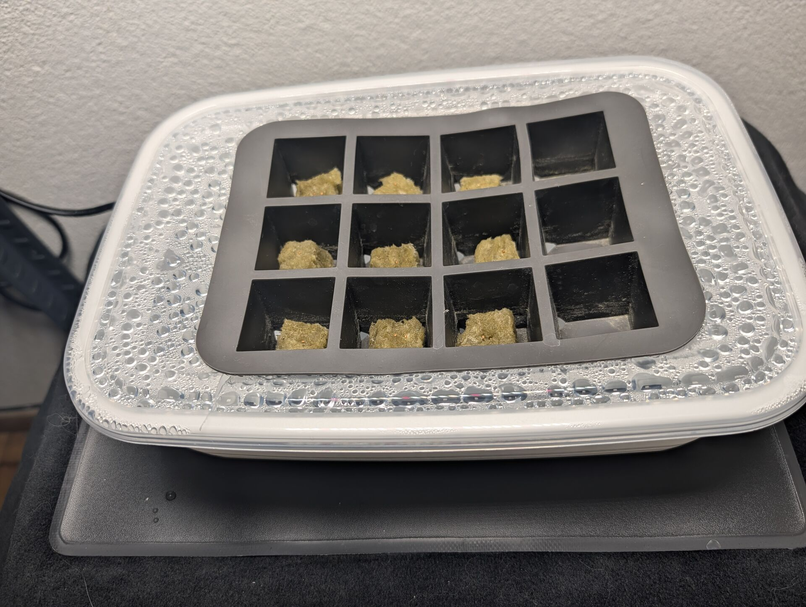
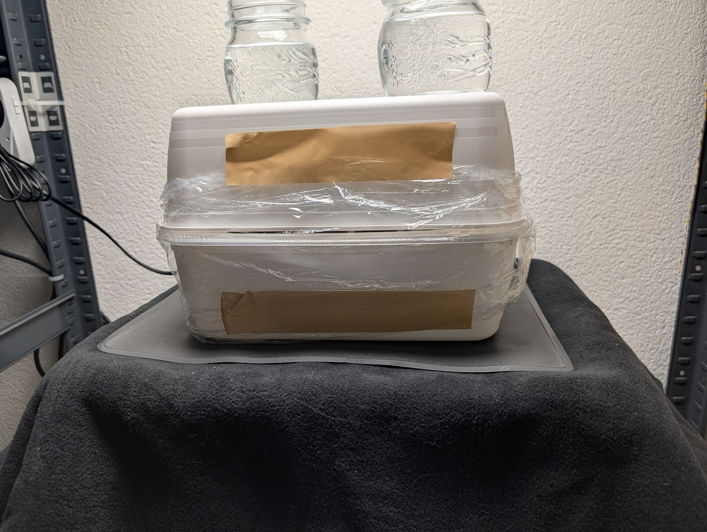
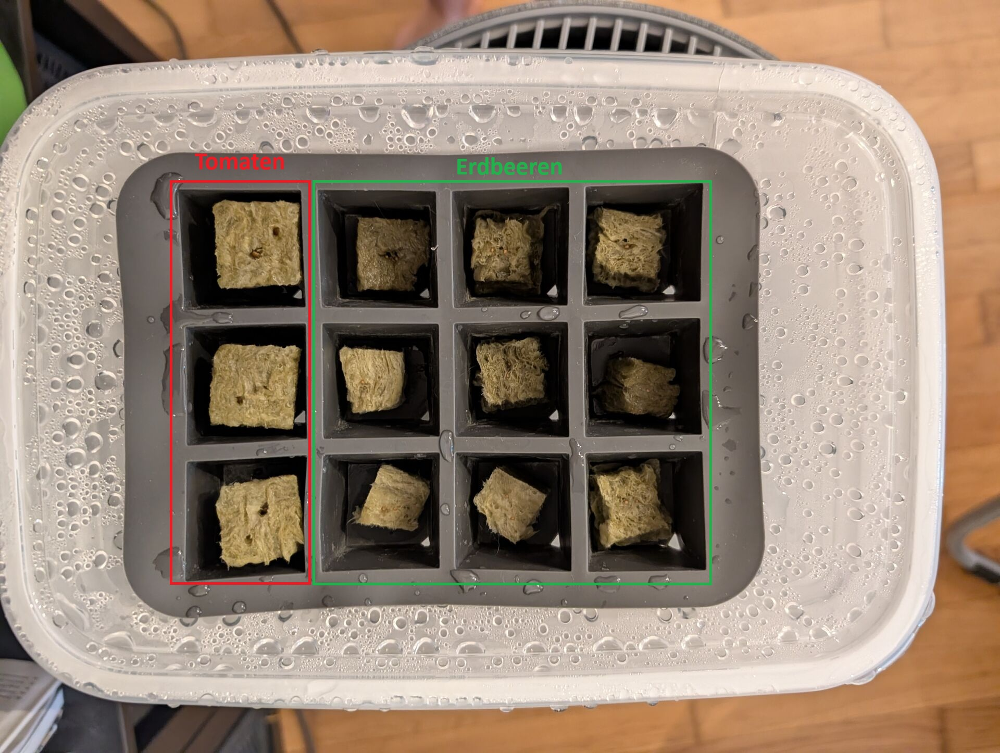
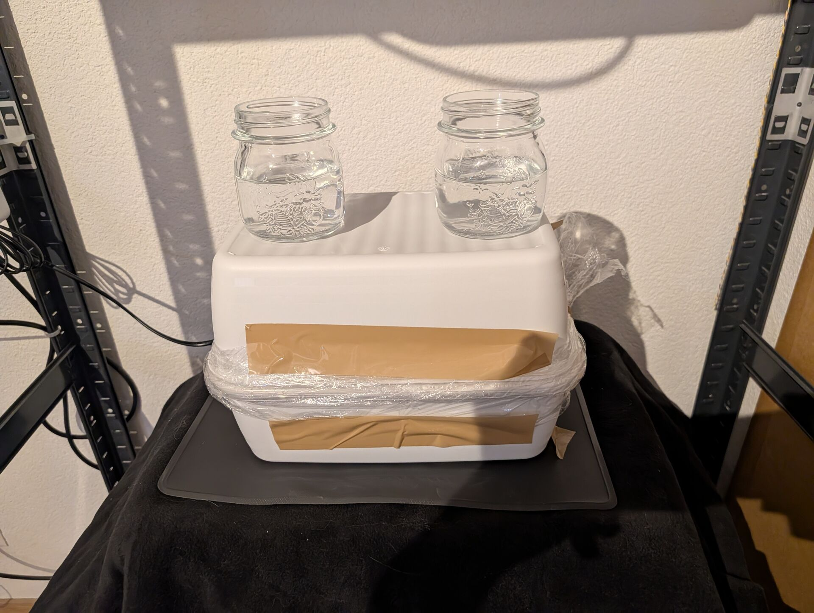
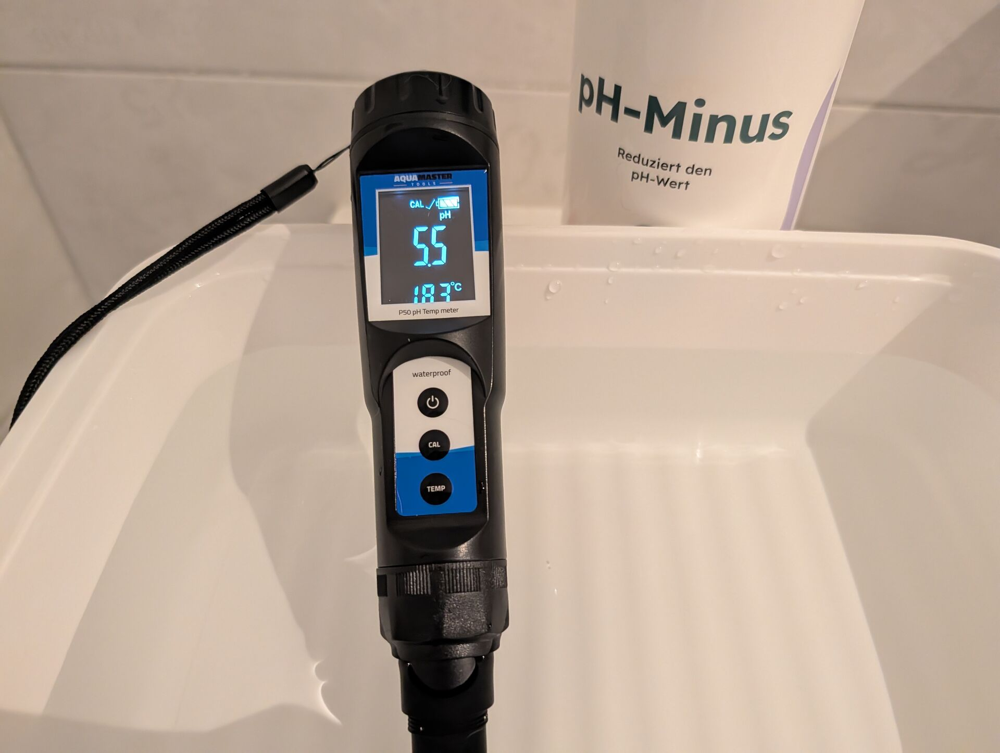
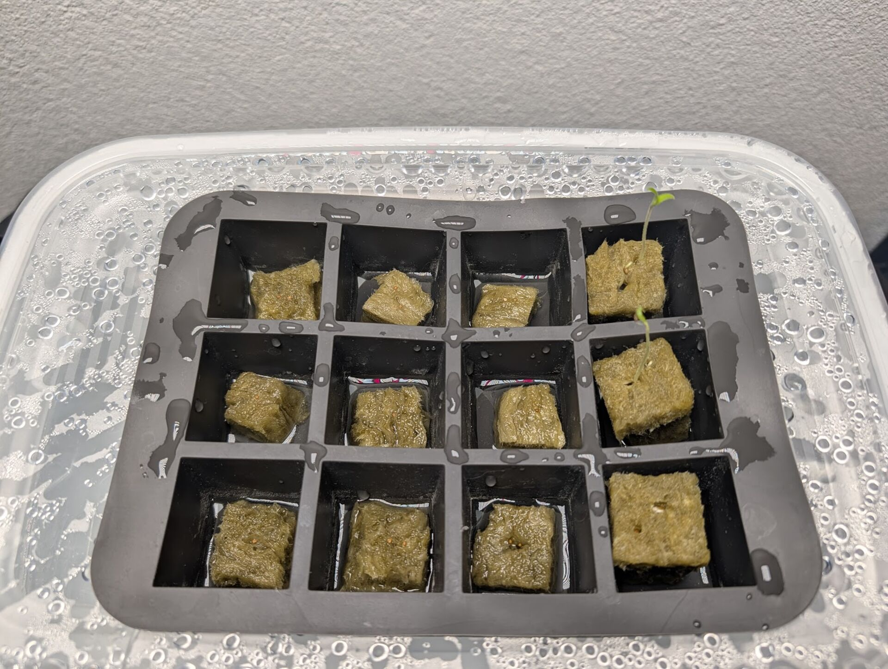
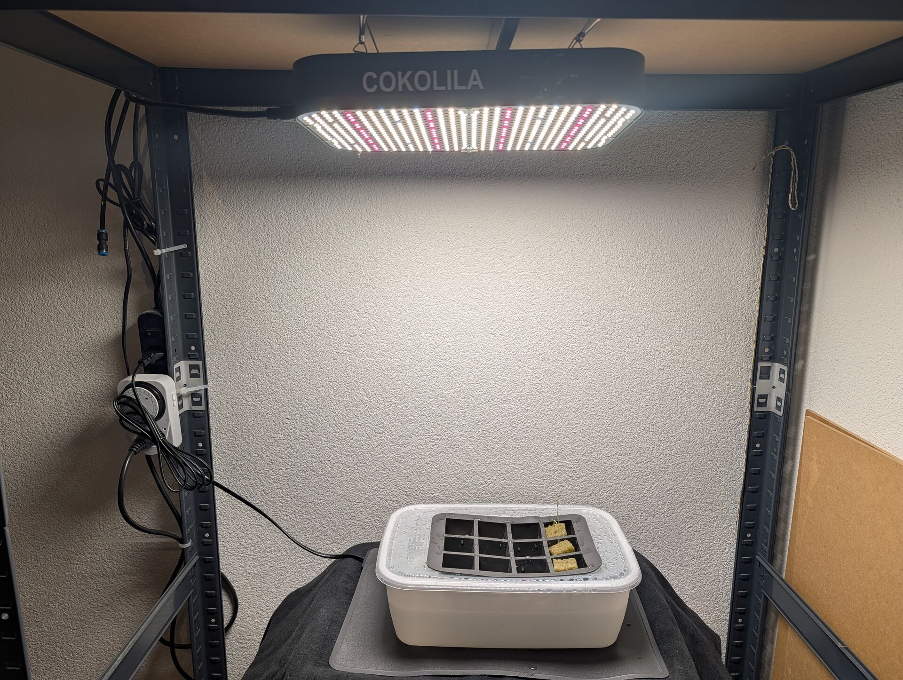

# San Marzano Tomaten & Erdbeeren Florian

[← Zurück zur Übersicht](../readme.md)

---

## Einführung

Mittels Deep Water Culture sollen sowohl Erdbeeren als auch Tomaten gleichzeitig, aber in unterschiedlichen Behältern, grossgezogen werden.

## Setup

- Keimen - Tupper & Eiswürfel Konstruktion, Steinwolle, Root!t Heizmatte 5034517301034
- Growlampe - Cokolila Wachstumslicht, 240 V, B0BHP2SRPH
- Dünger - Terra Aquatica Tripart Dünger
- PH - FARMii PH Minus
- Wasser Pumpe - Luftpumpe Sicce Air Light 1000 60ltr/h
- Messgeräte - Aquamaster Tools pH Temp meter P50 Pro, Bluelab EC Mess-Stab Truncheon

## Phase 1: Anzucht & Keimung (Setzlings-Phase)

### 📊 Messwerte Übersicht

| Datum | Tag | pH | Temp Luft | Temp Wasser | Beleuchtungszeit | Intensität | Notiz / Link |
| :--- | :--- | :--- | :--- | :--- | :--- | :--- | :--- |
| 23.04. | 0 | 5.5 | 22.6°C | - | - | 0% | [Einweichen & Vorbereitung](#tag-0---23042026) |
| 24.04. | 1 | 5.5 | 23.2°C | - | 14h | 30% | [Start Erdbeeren](#tag-1---24042026) |
| 25.04. | 2 | 5.5 | 23.5°C | - | 14h | 30% | [Klima-Check](#tag-2---25042026) |
| 26.04. | 3 | 5.5 | 23°C | - | 14h | 30% | System bleibt geschlossen |
| 27.04. | 4 | 5.5 | 23.6°C | - | 14h | 30% | System bleibt geschlossen |
| 28.04. | 5 | 5.5 | 23.7°C | - | 14h | 30% | [Tomaten Vorbereitung](#tag-5---28042026) |
| 29.04. | 6 | 5.5 | 23.6°C | - | 14h | 30% | [Aussaat Tomaten](#tag-6---29042026) |
| 30.04. | 7 | - | - | - | 14h | 30% | System bleibt geschlossen |
| 01.05. | 8 | - | - | - | 14h | 30% | System bleibt geschlossen |
| 02.05. | 9 | - | - | - | 14h | 30% | System bleibt geschlossen |
| 03.05. | 10 | 5.5 | 23.7°C | 18.3°C | 14h | 40% | [Systemöffnung & pH-Optimierung](#tag-10---03052026) |

### 📝 Tages-Einträge

#### Tag 0 - 23.04.2026

Tupper mit lauwarmen Wasser gefüllt und PH reduziert auf 5.5. Steinwolle eingelegt.

#### Tag 1 - 24.04.2026

Steinwolle aus dem Wasser genommen, das Wasser ist in der Nacht durch die Wolle auf ca. 6.5 gestiegen. Wasser ausgekippt und in einer leeren 0.75l neues Wasser angemischt mit PH von 5.5. Davon einen guten Schluck ins Tupper gekippt, dann die Steinwolle ins Eiswürfelfach gelegt und die Erdbeer-Samen verteilt, 1-2 Samen auf 8 Steinwollen. Tupper auf die Heizmatte gestellt, Growlampe angestellt (Zeitschaltuhr, 14h täglich). Umgekehrtes Tupper als Deckel drüber, Buch zum beschweren des Deckels. Das Wasser soll etwas verdampfen und mit dem Dunst die Steinwolle feucht halten.

#### Tag 2 - 25.04.2026

Dunstbildung erfolgreich, Dichtung hält, System bleibt die nächsten Tage in sich geschlossen.

#### Tag 5 - 28.04.2026

System bleibt weiter in sich geschlossen. Aber in einem seperaten Behälter nochmals Steinwolle in 5.5 PH Wasser eingelegt um die Tomatensamen morgen mitkeimen zu lassen.

#### Tag 6 - 29.04.2026

Bei den Erdbeeren ist noch keine Keimung sichtbar, die Steinwolle ist jedoch weiterhin sehr feucht und der Deckel stark mit Kondenswasser bedeckt. Die gestern eingeweichte Steinwolle wurde in die freien Plätze des Eiswürfelfachs gesetzt und mit jeweils zwei San Marzano Tomatensamen bestückt. Mit einem Hölzchen wurden die Samen ca. 0,5 cm tief eingedrückt. Zur Sicherung der Luftfeuchtigkeit wurde ein kleiner Schluck pH 5.5 Wasser nachgefüllt. Das System ist nun wieder komplett luftdicht mit Folie, Tape und Gläsern versiegelt.

#### Tag 10 - 03.05.2026

Das pH-Meter mit den neuen Lösungen (7.0 und 4.01) kalibriert. Da zwei Tomaten bereits kräftig gekeimt sind, wurde die Folie komplett entfernt und das Wasser in der Box mit pH-Minus auf exakt 5.5 eingestellt. Die Steinwolle-Blöcke haben nun direkten Kontakt zum Wasser, und die Lichtintensität wurde auf 40% erhöht, damit die Keimlinge nicht spargeln und um das Wachstum der ersten Keimlinge zu unterstützen.

## Phase 2: Transfer & Etablierung (Vegetative Phase I)

| Datum | Tag | pH 🍅 | pH 🍓 | ec 🍅 | ec 🍓 | T-Luft | T-H2O 🍅 | T-H2O 🍓 | Licht | Link |
| :--- | :--- | :--- | :--- | :--- | :--- | :--- | :--- | :--- | :--- | :--- |
| *noch* | *keine* | *Daten* | *(Phase 1* | *läuft* | *gerade)* | - | - | - | - | - |

## Phase 3: Wachstum & Erziehung (Vegetative Phase II)

## Phase 4: Blüte & Fruchtbildung (Generative Phase)
